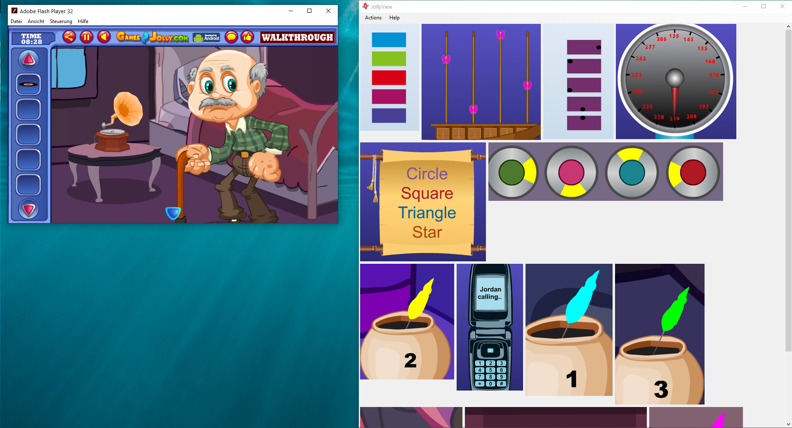

# JollyView

JollyView is a screenshot snippet manager, meant to help manage screenshots of hints and solutions when playing Flash escape games. It automatically picks up images that are copied into the Windows clipboard and displays them.

## Instructions

Place the JollyView window on your desktop, next to the escape game window. Use Win+Shift+S to make screenshots of clues.
JollyView will monitor the clipboard and pick them up automatically.

Double-click with the left mouse button to open an image in full size.
Double-click with the right mouse button to hide an image, e.g. when you don't need the hint anymore.
Hidden images can be shown again through the `Actions` menu.

